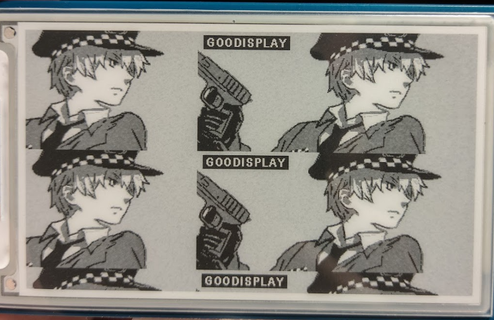
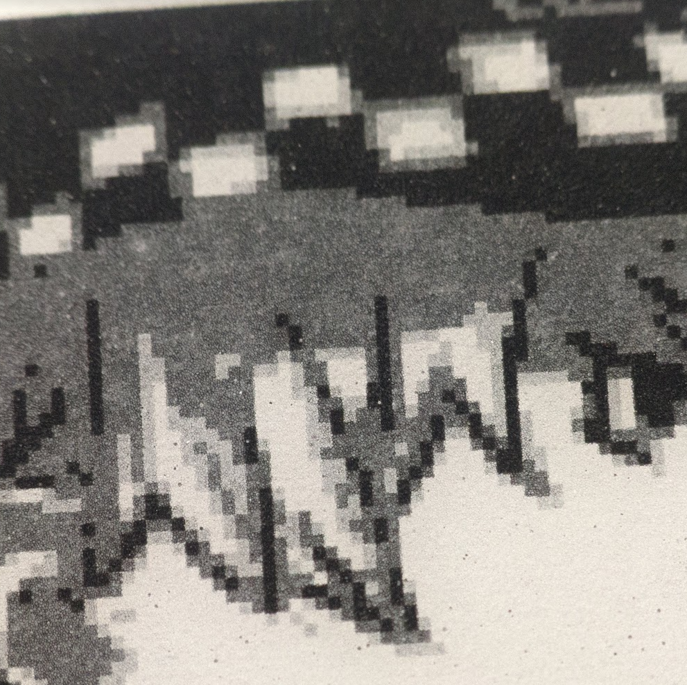

# GxEPD2_4G

## About this fork
Added support for Waveshare 3.7inch e-Paper HAT display\
[Waveshare Wiki](https://www.waveshare.com/wiki/3.7inch_e-Paper_HAT)

Grey levels with my LUT

## Arduino Display Library for SPI E-Paper Displays

- GxEPD2 variant with support for 4 grey levels on supported e-papers

- With full Graphics and Text support using Adafruit_GFX

- For SPI e-paper displays from Dalian Good Display 
- and SPI e-paper boards from Waveshare

### note on grey level support
- 4 grey levels are available on some e-papers that support differential refresh
- 4 grey level support can be used instead of differential refresh
- "old data" and "new data" controller buffers provides 2 bits per pixel
- the 4 states per pixel can produce 4 grey levels using a special waveform
- the 4 grey level waveform table is taken from demo from Good Display
- the 4 grey levels may differ from display to display, and may be temperature dependent
- ghosting can't be avoided; using clearScreen() helps

### important note :
- the display panels are for 3.3V supply and 3.3V data lines
- never connect data lines directly to 5V Arduino data pins, use e.g. 4k7/10k resistor divider
- series resistor only is not enough for reliable operation (back-feed effect through protection diodes)
- 4k7/10k resistor divider may not work with flat cable extensions or Waveshare 4.2 board, use level converter then
- do not forget to connect GND
- the actual Waveshare display boards now have level converters and series regulator, safe for 5V
- use 4k7 pull-down on SS for ESP8266 for boards with level converters
- note that 7.5" e-paper displays don't work reliable if fed from 3.3V Arduino pin
- note that Waveshare bords with "clever" reset circuit may need shortened reset pulse
- use `init(115200, true, 2, false)` for Waveshare boards with "clever" reset circuit
- note that Waveshare bords with "clever" reset circuit need 1k pull-up on RST on ESP8266, or different pin

### Paged Drawing, Picture Loop
 - This library uses paged drawing to limit RAM use and cope with missing single pixel update support
 - buffer size can be selected in the application by template parameter page_height, see GxEPD2_Example
 - Paged drawing is implemented as picture loop, like in U8G2 (Oliver Kraus)
 - see https://github.com/olikraus/u8glib/wiki/tpictureloop
 - Paged drawing is also available using drawPaged() and drawCallback(), like in GxEPD
- ` // GxEPD style paged drawing; drawCallback() is called as many times as needed `
- ` void drawPaged(void (*drawCallback)(const void*), const void* pv) `
- paged drawing is done using Adafruit_GFX methods inside picture loop or drawCallback

### Full Screen Buffer Support
 - full screen buffer is selected by setting template parameter page_height to display height
 - drawing to full screen buffer is done using Adafruit_GFX methods without picture loop or drawCallback
 - and then calling method display()

### Low Level Bitmap Drawing Support
 - bitmap drawing support to the controller memory and screen is available:
 - either through the template class instance methods that forward calls to the base display class
 - or directly using an instance of a base display class and calling its methods directly

### Supporting Arduino Forum Topics:

- Waveshare e-paper displays with SPI: http://forum.arduino.cc/index.php?topic=487007.0
- Good Dispay ePaper for Arduino : https://forum.arduino.cc/index.php?topic=436411.0

### Note on documentation
- GxEPD2 uses Adafruit_GFX for Graphics and Text support, which is well documented there
- GxEPD2 uses meaningful method names, and has some comments in the header files
- consult the header files GxEPD2_BW.h, GxEPD2_4G.h and GxEPD2_GFX.h
- for the concept of paged drawing and picture loop see: 
- https://github.com/olikraus/u8glib/wiki/tpictureloop

### Supported SPI e-paper panels from Good Display:
- GDEW0213I5F    2.13" b/w flexible
- GDEW029T5      2.9" b/w
- GDEW029T5D     2.9" b/w
- GDEW029I6FD    2.9" b/w flexible
- GDEM029T94     2.9" b/w
- GDEW027W3      2.7" b/w
- GDEW0371W7     3.71" b/w 416x240
- GDEW042T2      4.2" b/w
- GDEW075T7      7.5" b/w 800x480

### Supported SPI e-paper panels from Waveshare
- ED037TC1       3.7" b/w 480x280

### Version 1.0.6
- added support for mixed b/w and 4G content, fast b/w partial refresh on grey background
- added classes GxEPD2_4G_BW_R and GxEPD2_4G_4G_R, for reference to common driver class
- added example GxEPD2_4G_MixedExample to show use of fast b/w on grey
- mixed content is experimental
- mixed content with fast b/w refresh can't be used with GDEM029T94
- added option to select an alternate HW SPI channel and/or SPI settings
- by method selectSPI(SPIClass& spi, SPISettings spi_settings) of driver base class GxEPD2_4G_EPD
- by calling selectSPI before calling init() of display class
- or by calling extended init() method that has these parameters added
- tested with RPi Pico RP2040 using Good Display DESPI-PICO connection shield
- updated GxEPD2_4G_Example to show use with DESPI-PICO
- DESPI-PICO: see https://www.good-display.com/product/393.html
- added optional init parameter "reset_duration" in ms
- reset_duration = 2 may help with "clever" reset circuit of newer boards from Waveshare
- changed the default reset duration to 10ms instead of 20ms
- changed the delay after reset to 10ms or reset duration, whichever is higher, instead of 200ms
- added a busyCallback feature, to allow to service periodic actions during wait for BUSY termination
- ` // register a callback function to be called during _waitWhileBusy continuously. `
- ` void setBusyCallback(void (*busyCallback)(const void*), const void* busy_callback_parameter = 0); `
- added some updates to solve compiler warnings (ALL for GCC for AVR)
#### Version 1.0.5
- fix for STM32 official package pin number range (int16_t)
- fix for refresh(int16_t x, int16_t y, int16_t w, int16_t h) methods screen intersection
#### Version 1.0.4
- added support for GDEW029T5D
- added support for GDEW029I6FD
- added support for GDEM029T94
- GDEM029T94 has no partial refresh with grey refresh mode
- improved handling of switching between refresh modes
#### Version 1.0.3
- renamed top level files and classes to allow co-existence of installed GxEPD2_4G and GxEPD2
- fixed drawGreyPixmap() issues
- additional fixes
#### Version 1.0.2
- added method drawGreyPixmap() to buffered graphics
- void drawGreyPixmap(const uint8_t pixmap[], int16_t depth, int16_t x, int16_t y, int16_t w, int16_t h);
#### Version 1.0.1
- added support for GDEW075T7
- GDEW075T7 uses same wavetable as the other ones, no "official" (demo) yet
- GDEW075T7 grey level behaviour is less good than e.g. on GDEW0371W7
- some fixes and improvements
#### Version 1.0.0
- initial version for 4 grey level support, experimental
- (slow) partial refresh doesn't work with 4G on some panels
